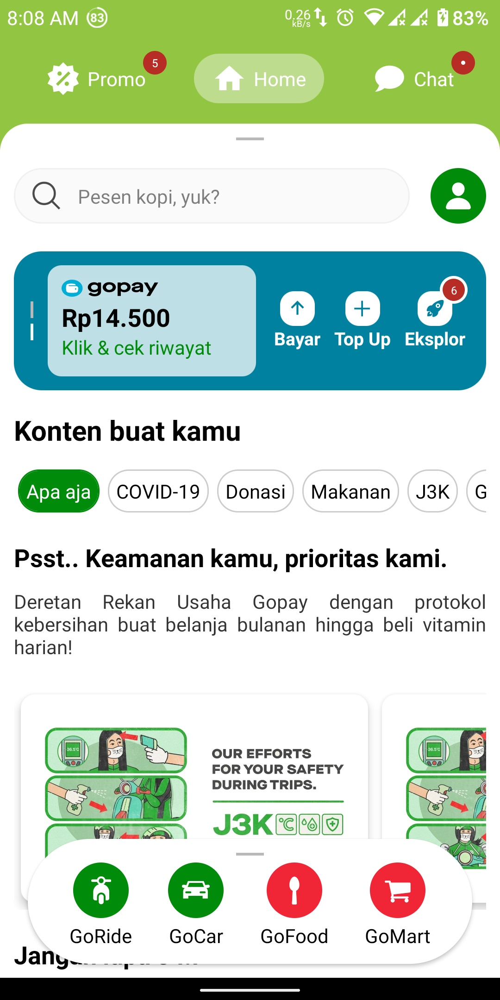

# GoRide Clone Static

## Contents

- [Description](#description)
- [Features](#features)
- [Preview](#preview)
- [Requirements](#requirements)
- [Installation](#installation)
- [Download APK](#download)

## Description

**GoRide Clone** is a clone for gojek go ride application

This repository serve for Mobile version

## Features

- search POI origin & destination
- Fitur select location/place via map
- Ubah origin / destinasi
- map dan line rute perjalanan
- est harga perjalanan
- est jarak
- button order
- edit origin/destinasi
- Source of fund pembayaran LinkAja (data statis)
- Redux

## Preview

<div style="text-align:center">




</div>

## Requirements

- `React Native 0.64`
- Map Google SDK
- Open Route Service

## Installation

1. Open your terminal or command prompt
2. Clone the project

```bash
$ git clone https://github.com/sipamungkas/go-ride-clone-static.git
```

3. Set Environment

- copy env.example to .env and fill `OPEN_ROUTE_SERVICE_KEY= with` your key (you can get the key [here](https://openrouteservice.org/dev/#/api-docs) )
- copy android/local.properties.example to android/local.properties and fill the google api key (you can get the api key [here](https://developers.google.com/maps/documentation/android-sdk/signup))

4. Move inside the directory and install and link dependency

```bash
$ cd go-ride-clone-static
$ yarn install
$ npx react-native link
```

5. Run program

```bash
$ npx react-native run-android // run in android
$ npx react-native run-ios //run in ios
```

6. Build Apps

- [Publishing for Google Play](https://reactnative.dev/docs/signed-apk-android)

- [Publishing for Apple Store](https://reactnative.dev/docs/publishing-to-app-store)

## Download

- [Download APK](https://drive.google.com/file/d/1ZgyyLRm75B-jz6sQsHCdnnLKuvpvA4__/view?usp=sharing)
